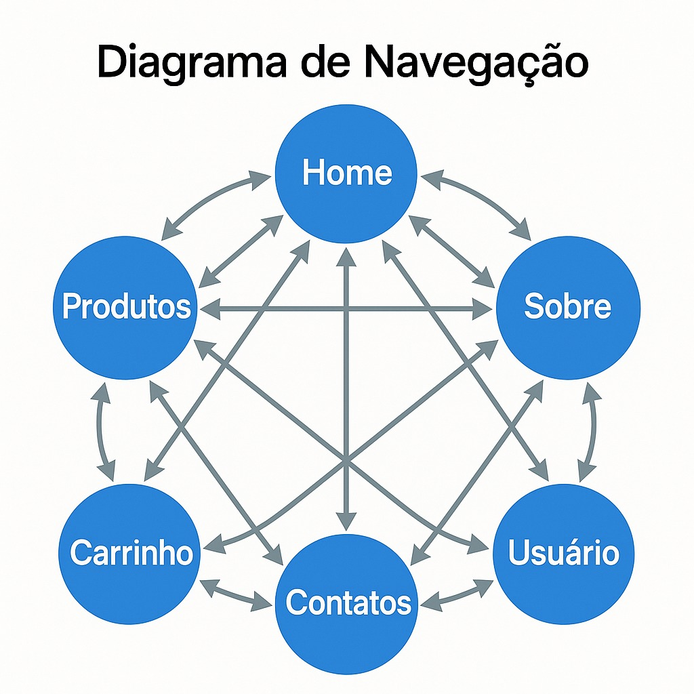

# Buy Things – Loja Online  
**SCC0219 - Introdução ao Desenvolvimento Web • 1º sem/2025**

## Equipe
| Integrante | Nº USP |
|------------|--------|
| Bruno Kazuya Yamato Sakaji | 14562466 |
| Guilherme Pacheco de Oliveira Souza | 11797091 |
| Leonardo Marangoni | 14747614 |

---

## 1 • Requisitos

| Código | Descrição|
|--------|-----------|
| R-01 | Exibir catálogo de produtos com preço e imagem |
| R-02 | Exibir resumo do pedido (subtotal, frete, desconto, total) |
| R-03 | Navegação entre Home → Produtos → Carrinho |
| R-04 | Layout responsivo (mobile-first) |

---

## 2 • Descrição do Projeto

### 2.1 Visão geral
*BuyThings* uma loja online feita em React. O objetivo nessa etapa é de criar toda a interface e funcionalidade do lado do cliente.


### 2.2 Estrutura do projeto
```
├── capturas
│   ├── adm1.png
│   ├── cadastro.png
│   ├── carrinho.png
│   ├── contato.png
│   ├── home1.png
│   ├── home2.png
│   ├── home3.png
│   ├── login.png
│   ├── produtos1.png
│   ├── produtos2.png
│   ├── sobre.png
│   ├── user.png
├── milestone1
│   ├── css
│   │   ├── estilo.css
│   ├── img
│   │   ├── diagrama.jpg
│   │   ├── image.png
│   │   ├── produto1.avif
│   │   ├── produto2.avif
│   │   ├── produto3.avif
│   │   ├── produto4.avif
│   │   ├── produto5.avif
│   │   ├── produto6.avif
│   ├── javascript
│   │   ├── script.js
│   ├── carrinho.html
│   ├── index.html
│   ├── products.html
├── milestone2
|   ├── public
|   |   ├── img
|   │   ├── favicon.ico
|   ├── src
|   │   ├── App.jsx
|   │   ├── components
|   │   ├── pages
|   │   ├── contexts
|   │   ├── index.css
|   │   ├── main.jsx
├── front-end
|   ├── public
|   |   ├── img
|   │   ├── favicon.ico
|   ├── src
|   │   ├── App.jsx
|   │   ├── components
|   │   ├── pages
|   │   ├── contexts
|   │   ├── index.css
|   │   ├── main.jsx
├── back-end
|   ├── controllers
|   ├── middleware
|   ├── models
|   ├── public
|   ├── routes
|   ├── utils
|   ├── app.js
├── readme.md
```
> *Observação:* todas as imagens de snapshots do prototipo estão em `capturas/` na raiz do projeto.


### 2.2 Diagrama de Navegação


## 3 • Sobre o projeto

### 3.1 Como instalar
- Node.js ≥ 14 
- git clone https://github.com/BrunoKazuya/web_e-commerce
- npm install
- cd front-end
- npm install
- cd ..
- cd back-end
- npm install
- cd ..
- npm run dev

Pronto com isso você pode acessar no navegador http://localhost:5173

### 3.2 Tipos de usuario

| Tipo de usuário | Descrição |
|-----------------|-----------|
| Visitante | Ele consegue navegar pelas paginas home, produtos, sobre, contato, pagina do produto e autenticação. Ele não consegue adicionar itens ao carrinho e não efetua compra |
| Cliente | Para ser esse tipo de usuário basta criar uma conta. Ele pode adicionar itens ao carrinho e efetuar compras, além disso ele pode editar o seu perfil |
| Administrador | Por padrão existe um administrador para acessar basta fazer o login com o email: admin@admin.com e a senha: 12345678. Ele pode acessar a dashboard onde pode gerenciar a loja, adicionando, atualizando e deletando produtos e pode adicionar usuário, atualizar a permissão dele e também pode deletar |

## 4 • Funcionalidades

| Funcionalidade | Descrição |
|-----------------|-----------|
| Adicionar ao carrinho | É póssivel adicionar itens ao carrinho e mudar a quantidade deles (o mínimo é 1 e o máximo é quantidade em estoque) |
| Realizar compra | É possível realizar a "compra" dos itens no carrinho, com a diminuição da quantidade em estoque dos itens comprados |	
| Gerenciar produto | O administrador pode adicionar, atualizar e remover produtos do catálogo |
| Gerenciar usuário | O administrador pode adicionar, atualizar apenas a permissão e remover usuários do sistema |
| Editar perfil | O cliente pode editar o seu perfil, mudando o nome, email e senha |
| Autenticação | O cliente pode se autenticar no sistema, com o email e senha, e também pode se cadastrar |
| Dashboard | O administrador pode acessar a dashboard onde pode gerenciar os produtos e usuários |
|Filtro de produtos | É possível filtrar os produtos por categoria, nome e preço |


## 5 • Testes de erro
| Nº | Módulo           | Caso de Teste                        | Descrição                                                          | Resultado Esperado                                                |
| -- | ---------------- | ------------------------------------ | ------------------------------------------------------------------ | ----------------------------------------------------------------- |
| 1  | Registro Usuário | Cadastro com dados válidos           | Preencher todos os campos obrigatórios e enviar                    | Usuário cadastrado com sucesso                                    |
| 2  | Registro Usuário | Cadastro com e-mail já existente     | Tentar cadastrar com e-mail já usado                               | Exibir mensagem "Email já cadastrado"                             |
| 3  | Registro Usuário | Cadastro com telefone inválido       | Informar número fora do formato (xx)xxxxxxxxx com 10 ou 11 dígitos | Exibir mensagem "Telefone inválido, precisa de 10 ou 11 dígitos"  |
| 4  | Registro Usuário | Cadastro com endereço sem número     | Deixar campo número em branco                                      | Exibir mensagem "Número obrigatório"                              |
| 5  | Registro Usuário | Cadastro com CEP inválido            | Digitar CEP fora do formato esperado                               | Exibir mensagem "CEP inválido"                                    |
| 6  | Login            | Login com credenciais válidas        | Login com usuário e senha corretos                                 | Login bem-sucedido                                                |
| 7  | Login            | Login com senha errada               | Informar senha incorreta                                           | Exibir mensagem "E-mail ou senha inválidos"                       |
| 8  | Login            | Login com e-mail inválido            | Email fora do formato                                              | Exibir mensagem "E-mail inválido"                                 |
| 9  | Produtos         | Listagem de produtos                 | Acessar página inicial                                             | Produtos carregados                                               |
| 10 | Produtos         | Filtro por categoria                 | Selecionar uma categoria                                           | Produtos da categoria aparecem                                    |
| 11 | Produtos         | Buscar produto existente             | Buscar por nome válido                                             | Produto aparece                                                   |
| 12 | Produtos         | Buscar produto inexistente           | Buscar termo que não existe                                        | Exibir mensagem "Nenhum produto encontrado"                       |
| 13 | Produtos         | Buscar por tag correta               | Buscar usando uma tag válida                                       | Produtos com a tag aparecem                                       |
| 14 | Produtos         | Buscar por tag inexistente           | Buscar por tag que não existe                                      | Exibir mensagem "Nenhum produto encontrado"                       |
| 15 | Carrinho         | Adicionar item ao carrinho           | Clicar em "Adicionar"                                              | Produto adicionado                                                |
| 16 | Carrinho         | Adicionar quantidade negativa        | Inserir quantidade negativa                                        | Não é possível adicionar quantidade negativa                      |
| 17 | Carrinho         | Adicionar além do estoque            | Inserir quantidade maior que o estoque                             | Não é possível adicionar além do estoque                          |
| 18 | Carrinho         | Remover item                         | Clicar em "Remover"                                                | Item removido                                                     |
| 19 | Carrinho         | Atualizar quantidade                 | Alterar quantidade                                                 | Total recalculado                                                 |
| 20 | Endereço         | Adicionar endereço válido            | Preencher CEP, número, complemento                                 | Endereço salvo                                                    |
| 21 | Endereço         | Adicionar CEP inválido               | CEP inexistente ou fora do formato                                 | Exibir mensagem "CEP não encontrado"                              |
| 22 | Endereço         | Remover endereço                     | Clicar em "Remover"                                                | Endereço deletado                                                 |
| 23 | Pagamento        | Adicionar cartão válido              | Preencher dados corretos (passar no Luhn)                          | Cartão salvo                                                      |
| 24 | Pagamento        | Adicionar cartão com letras          | Inserir letras no número                                           | Não permite letras na entrada do número de cartão                 |
| 25 | Pagamento        | Adicionar cartão inválido (Luhn)     | Número que não passa no Luhn                                       | Exibir mensagem "Número de cartão inválido"                       |
| 26 | Pagamento        | Data de expiração no passado         | Informar validade anterior a hoje                                  | Exibir mensagem "Cartão expirado"                                 |
| 27 | Pagamento        | Data de expiração muito no futuro    | Data maior que 15 anos no futuro                                   | Exibir mensagem "Ano muito no futuro"                             |
| 28 | Pagamento        | Mês inválido na validade             | Informar mês > 12 ou <= 0                                          | Exibir mensagem "Mês inválido"                                    |
| 29 | Pagamento        | CVV inválido                         | Informar CVV com menos de 3 ou mais de 4 dígitos                   | Exibir mensagem "CVV inválido"                                    |
| 30 | Pagamento        | Remover cartão                       | Clicar em "Remover"                                                | Cartão removido                                                   |
| 31 | Pedido           | Finalizar pedido                     | Escolher endereço + cartão e finalizar                             | Pedido criado                                                     |
| 32 | Pedido           | Ver histórico de pedidos             | Ir em "Meus Pedidos"                                               | Listagem de pedidos                                               |
| 33 | Upload Imagem    | Upload de imagem                     | Fazer upload pelo admin                                            | Imagem salva                                                      |
| 34 | API              | GET /api/products                    | Testar rota GET                                                    | Resposta JSON                                                     |
| 35 | API              | POST /api/users/login                | Fazer POST com credenciais válidas                                 | Token JWT recebido                                                |
| 36 | API              | CORS na porta 5173                   | Acessar front conectado ao back                                    | Sem erro CORS                                                     |
| 37 | Integração       | Fluxo completo                       | Cadastro → Login → Compra                                          | Fluxo sem falha                                                   |
| 38 | Admin            | Adicionar produto                    | Informar nome, preço, quantidade                                   | Produto adicionado                                                |
| 39 | Admin            | Remover produto                      | Clicar em remover                                                  | Produto deletado                                                  |
| 40 | Admin            | Editar produto                       | Atualizar info                                                     | Produto atualizado                                                |
| 41 | Admin            | Preço negativo                       | Tentar cadastrar preço <= 0                                        | Exibir mensagem "O preço deve ser maior que R\$ 0,00"             |
| 42 | Admin            | Quantidade negativa                  | Tentar cadastrar quantidade negativa                               | Exibir mensagem "O estoque não pode ser negativo"                 |
| 43 | Admin            | Descrição com menos de 10 caracteres | Tentar cadastrar descrição curta                                   | Exibir mensagem "A descrição precisa ter no mínimo 10 caracteres" |
| 44 | Admin            | Categoria em branco                  | Não selecionar categoria                                           | Exibir mensagem "Você deve selecionar uma categoria"              |
| 45 | Admin            | Imagem do produto ausente            | Tentar salvar produto sem imagem                                   | Exibir mensagem "A imagem do produto é obrigatória"               |
| 46 | Admin            | Adicionar cliente                    | Preencher formulário cliente                                       | Cliente adicionado                                                |
| 47 | Admin            | Remover cliente                      | Clicar em remover                                                  | Cliente removido                                                  |
| 48 | Admin            | Editar cliente                       | Alterar dados                                                      | Cliente atualizado                                                |
| 49 | Admin            | Adicionar admin                      | Preencher dados admin                                              | Admin criado                                                      |
| 50 | Admin            | Remover admin                        | Remover admin                                                      | Admin removido                                                    |
