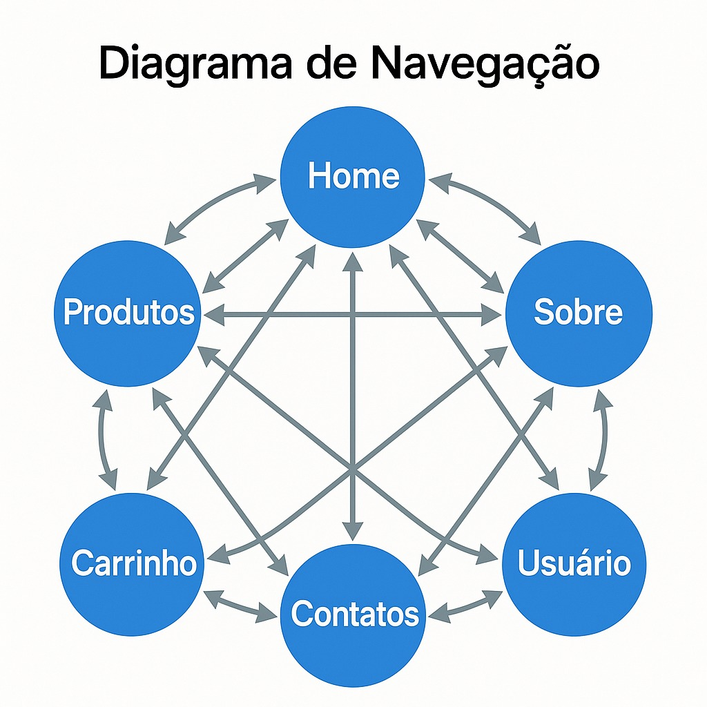

# Buy Things – Loja Online  
**SCC0219 - Introdução ao Desenvolvimento Web • 1º sem/2025**

## Equipe
| Integrante | Nº USP |
|------------|--------|
| Bruno Kazuya Yamato Sakaji | 14562466 |
| Guilherme Pacheco | 11797091 |
| Leonardo Marangoni | 14747614 |

---

## 1 • Requisitos

| Código | Descrição|
|--------|-----------|
| R-01 | Exibir catálogo de produtos com preço e imagem |
| R-02 | Exibir resumo do pedido (subtotal, frete, desconto, total) |
| R-03 | Navegação entre Home → Produtos → Carrinho |
| R-04 | Layout responsivo (mobile-first) |

---

## 2 • Descrição do Projeto

### 2.1 Visão geral
*BuyThings* é um protótipo de loja online focado exclusivamente em *HTML* e *CSS* nesta etapa inicial (sem JavaScript). O objetivo é demonstrar navegação entre páginas e consistência visual em todos os dispositivos.


### 2.2 Estrutura do projeto
```
├── css
│   ├── estilo.css
├── html
│   ├── carrinho.html
│   ├── index.html
|   ├── products.html
├── img
│   ├── diagrama.jpg
│   ├── image.png
│   ├── produto1.avif
│   ├── produto2.avif
│   ├── produto3.avif
│   ├── produto4.avif
│   ├── produto5.avif
│   ├── produto6.avif
├── capturas
│   ├── adm1.png
│   ├── cadastro.png
│   ├── carrinho.png
│   ├── contato.png
│   ├── home1.png
│   ├── home2.png
│   ├── home3.png
│   ├── login.png
│   ├── produtos1.png
│   ├── produtos2.png
│   ├── sobre.png
│   ├── user.png
├── readme.md
```

> *Observação:* todas as imagens de snapshots do prototipo estão em `capturas/` na raiz do projeto.


### 2.2 Diagrama de Navegação


## 3 • Sobre o projeto

### 3.1 Descrição das paginas
|Página             | Função                                          | 
|--------------------|-------------------------------------------------|
| **index.html**   | Home/vitrine com banner, seção de destaques, categorias e CTAs. |
| **products.html**| Catálogo completo de produtos em grade responsiva. | 
| **carrinho.html**| Mock‑up do carrinho (lista de itens e resumo de valores). |

## 3.2 Componentes principais

| Recurso                | Descrição                                                         |
|------------------------|-------------------------------------------------------------------|
| *Cabeçalho fixo*     | Logo BuyThings, menu (Produtos, About, Contact) e ícones. Facilita navegação completa entre páginas. |
| *Cards de produto*   | Imagem, título, preço e botões de ação (ainda não funcionais). |
| *Grid/Flex Layout*   | Organiza banners, grades e categorias e garante responsividade inicial. |
| *Rodapé padrão*      | Links institucionais (Sobre, Contato) e copyright. |

